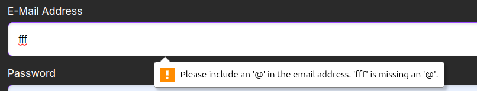
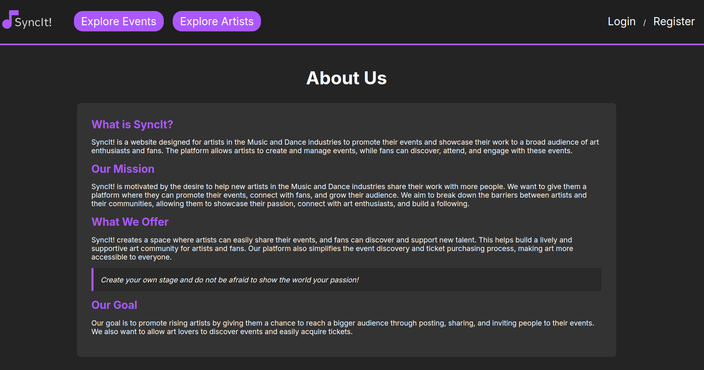
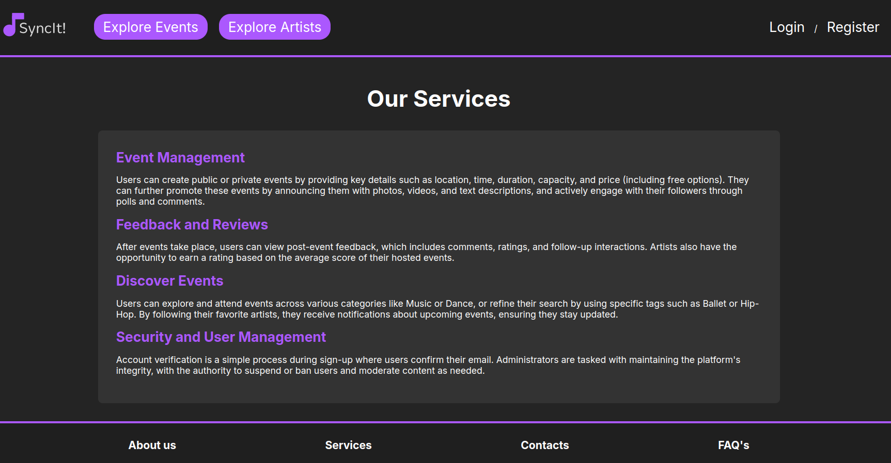
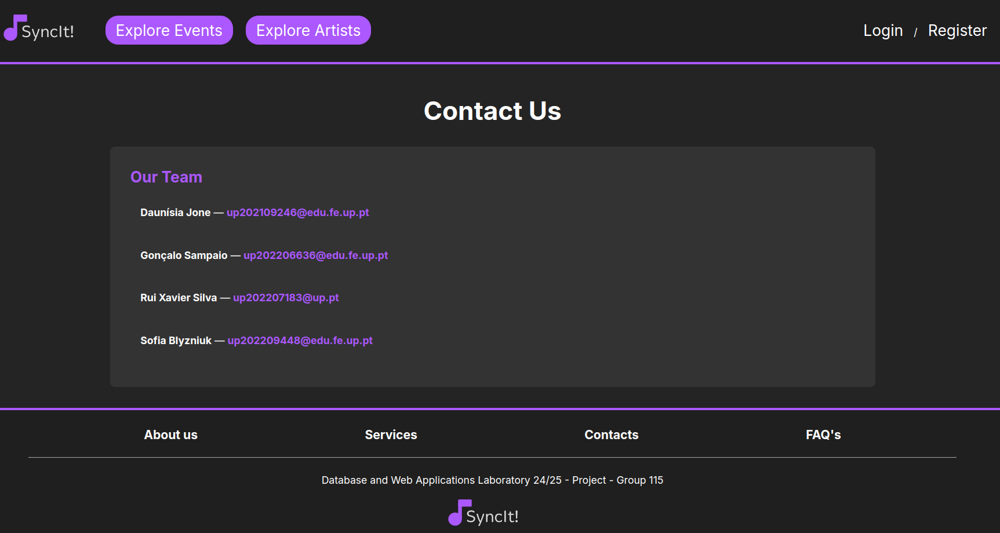
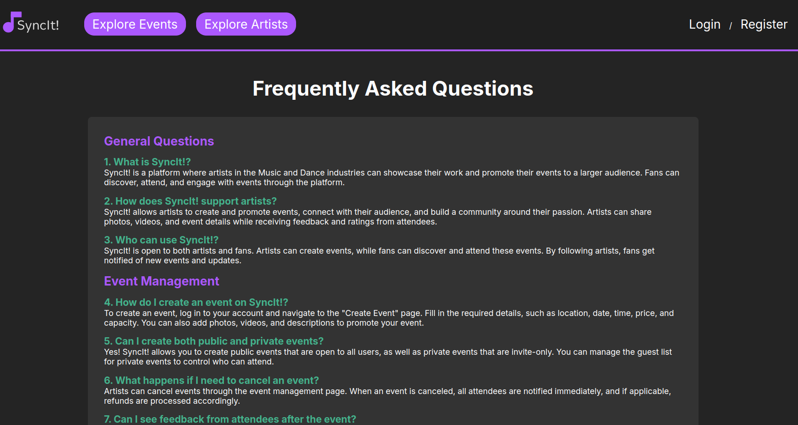
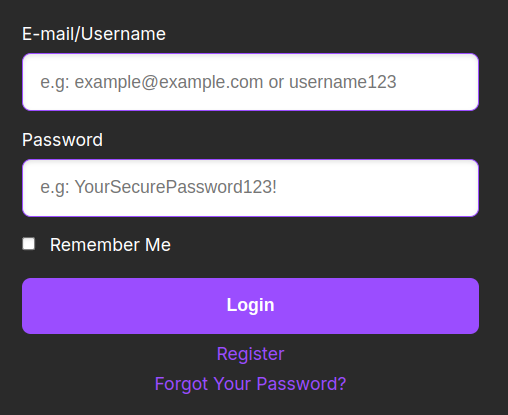

# PA: Product and Presentation
SyncIt! is a website designed for artists in the Music and Dance industries to promote their events and showcase their work to a broad audience of art enthusiasts and fans. The platform allows artists to create and manage events, while fans can discover, attend, and engage with these events.

## A9: Product

SyncIt! is designed to simplify the event discovery process for users, allowing them to easily browse events by category and purchase tickets with just a few clicks. Users can explore artists' profiles to view their upcoming events, making it effortless to connect with and support their favorite performers.
The platform's intuitive interface ensures that finding and promoting events is straightforward, empowering both artists and fans to engage with the vibrant music and dance community. SyncIt! aims to foster meaningful connections between artists and their audiences.

# 1. Installation

The final version of the souce code can be found here:
`https://gitlab.up.pt/lbaw/lbaw2425/lbaw24115`

To start the image available, the following Docker command can be used: 
`docker run -d --name lbaw24115 -p 8001:80 gitlab.up.pt:5050/lbaw/lbaw2425/lbaw24115`


# 2. Usage
**2.1. Administration Credentials**

| Username                 | Password         |
|--------------------------|------------------|
| edgar@example.com        |  12345678        |


**2.2. User Credentials**

| Username  | Password        |
|-----------|-----------------|
| edgar     |  12345678       |


# 3. Application Help

Help features have been implemented throughout the SyncIt! platform to enhance user experience and provide assistance when needed. These include:
**Alert messages:**  The system displays contextual alerts for various user actions, providing immediate feedback and guidance.


Figure 1: SyncIt! email format alert 

**Static pages:** Dedicated help resources are available through static pages such as:

* About Us: Offers detailed information about SyncIt!, its mission, and the goal that drives the platform.

Figure 2: SyncIt! About Us page 

* Services: Users can learn about the various services offered by SyncIt!, helping them understand how to make the most of their experience.

Figure 3: SyncIt! Services page 

* Contacts: Provides users with contact information for support and inquiries, ensuring they can easily reach out for help when needed.

Figure 4: SyncIt! Contacts page 

* FAQs: The Frequently Asked Questions page addresses common queries, offering quick answers and guidance on using the platform effectively.

Figure 5: SyncIt! FAQs page 

**Input field placeholders:** To assist users in entering correct information, input fields are equipped with descriptive placeholders that indicate the expected content.



Figure 6: SyncIt! login input fields 

**Clearly labeled buttons:** All buttons on the platform are distinctly labeled to ensure users understand their functions at a glance.


Figure 7: SyncIt! labeled buttons 


# 4. Input Validation

As the back-end input validation mechanism, we utilized Laravel's Illuminate\Support\Facades\Validator class, which provides the ability to define and apply various validation rules. This was applied to validate inputs in forms such as the login/register form, the edit user profile form, and the event creation form, ensuring that all data adheres to strict rules before processing. 

**Back-End Validation**
* Validation in Event Creation: During event creation, fields like event_date, refund, and capacity are validated for type and range
```
$validator = Validator::make($data, [
    'event_date' => 'required|date|after_or_equal:tomorrow',
    'refund' => 'required|numeric|between:0,100',
    'capacity' => 'required|numeric|min:10',
]);
```

* Password Hash Validation: For secure password verification during login and account deletion, we used Laravel's Hash::check
```
if (!Hash::check($password, $this->password)) {
    return [
        'status' => false,
        'message' => 'The provided password is incorrect.',
    ];
}
```

**Front-End Validation**
For client-side validation, we utilized JavaScript to provide immediate feedback to users

* File Input Validation: When uploading a profile picture or event media, HTML `<input type="file">` ensures that users select a file before submission

```
<input type="file" id="profile_pic" name="profile_pic_url" required />
```

* Validation in Comment: When a user attempts to post a comment but leaves the input empty, a warning is displayed to alert them
```
if (commentText.trim() === '') {
        document.getElementById('error-new-comment').textContent = 'Please write a comment.';
        hasError = true;
    }
```


# 5. Check Accessibility and Usability

Accessibility: [Accessibility checklist](https://gitlab.up.pt/lbaw/lbaw2425/lbaw24115/-/blob/f4db682e1a6e0b0fcea9cf99c2706d210dafa856/files/Checklist%20de%20Acessibilidade%20-%20SAPO%20UX.pdf)

Usability: [Usability checklist](https://gitlab.up.pt/lbaw/lbaw2425/lbaw24115/-/blob/f4db682e1a6e0b0fcea9cf99c2706d210dafa856/files/Checklist%20de%20Usabilidade%20-%20SAPO%20UX.pdf)

# 6. HTML & CSS Validation

HTML Validation (pages: home, event, artist)

- Home page: [HTML Validation - Home Page](https://gitlab.up.pt/lbaw/lbaw2425/lbaw24115/-/blob/main/files/homehtmlvalidation.pdf)

- Event page: [HTML Validation - Event Page](https://gitlab.up.pt/lbaw/lbaw2425/lbaw24115/-/blob/main/files/eventhtmlvalidation.pdf)

- Artist page: [HTML Validation - Artist Page](https://gitlab.up.pt/lbaw/lbaw2425/lbaw24115/-/blob/main/files/artisthtmlvalidator.pdf)

CSS Validation (pages: home, event, artist)
- Home page: [CSS Validation - Home Page](https://gitlab.up.pt/lbaw/lbaw2425/lbaw24115/-/blob/main/files/homecssvalidation.pdf)

- Event page: [CSS Validation - Event Page](https://gitlab.up.pt/lbaw/lbaw2425/lbaw24115/-/blob/main/files/eventcssvalidation.pdf)

- Artist page: [CSS Validation - Artist Page](https://gitlab.up.pt/lbaw/lbaw2425/lbaw24115/-/blob/main/files/artisticssvalidation.pdf)

# 7. Revisions to the Project

# 8. Implementation Details
**8.1. Libraries Used**

* **Laravel** was used for serve-side management


**8.2. User Stories**
This subsection includes all high and medium priority user stories, sorted by module and state of implementation. 


| US Identifier | Name                     | Module                   | Priority | Team Members                             | State |
|---------------|--------------------------|--------------------------|----------|------------------------------------------|-------|
| US12          | Create account           | M01: Authentication      | High     | **Daunísia Jone**, Sofia Blyzniuk        | 100%  |
| US13          | Login                    | M01: Authentication      | High     | **Gonçalo Sampaio**, Sofia Blyzniuk      | 100%  |
| US15          | Logout                   | M01: Authentication      | High     | **Sofia Blyzniuk**                       | 100%  |
| US18          | Reset password           | M01: Authentication      | Medium   | **Daunísia Jone**, Sofia Blyzniuk        | 100%  |
| US20          | View profile             | M02: Users               | High     | **Xavier Silva**                         | 100%  |
| US21          | Edit profile             | M02: Users               | High     | **Xavier Silva**                         | 100%  |
| US22          | Purchase tickets         | M02: Users               | High     | **Daunísia Jone**, Gonçalo Sampaio       | 100%  |
| US23          | Upload profile picture   | M02: Users               | Medium   | **Sofia Blyzniuk**, Xavier Silva         | 100%  |
| US24          | View notifications       | M02: Users               | Medium   | **Gonçalo Sampaio**                      | 100%  |
| US25          | View event messages      | M02: Users               | Medium   | **Xavier Silva**, Daunísia Jone          | 100%  |
| US26          | View attendees list      | M02: Users               | Medium   | **Daunísia Jone**, Gonçalo Sampaio       | 100%  |
| US27          | Comment                  | M02: Users               | Medium   | **Sofia Blyzniuk**, Daunísia Jone        | 100%  |
| US28          | Edit comments            | M02: Users               | Medium   | **Gonçalo Sampaio**, Daunísia Jone, Sofia Blyzniuk | 100%  |
| US31          | Answer polls             | M02: Users               | Medium   | **Sofia Blyzniuk**                       | 100%  |
| US33          | Reminder                 | M02: Users               | Medium   | **Xavier Silva**                         | 100%  |
| US34          | Past events              | M02: Users               | Medium   | **Daunísia Jone**, Xavier Silva          | 100%  |
| US01          | Find events              | M03: Events and Tickets  | High     | **Sofia Blyzniuk**, Gonçalo Sampaio      | 100%  |
| US02          | Check event details      | M03: Events and Tickets  | High     | **Gonçalo Sampaio**                      | 100%  |
| US03          | Past events              | M03: Events and Tickets  | High     | **Xavier Silva**                         | 100%  |
| US04          | Search events            | M03: Events and Tickets  | High     | **Daunísia Jone**, Sofia Blyzniuk        | 100%  |
| US05          | Artist page              | M03: Events and Tickets  | High     | **Sofia Blyzniuk**, Gonçalo Sampaio      | 100%  |
| US16          | Create events            | M03: Events and Tickets  | High     | **Gonçalo Sampaio**, Sofia Blyzniuk      | 100%  |
| US17          | Invite users             | M03: Events and Tickets  | High     | **Xavier Silva**, Gonçalo Sampaio        | 100%  |
| US19          | Join/leave events        | M03: Events and Tickets  | High     | **Sofia Blyzniuk**, Gonçalo Sampaio      | 100%  |
| US36          | Review                   | M03: Events and Tickets  | Medium   | **Gonçalo Sampaio**, Daunísia Jone       | 100%  |
| US40          | Edit event               | M03: Events and Tickets  | High     | **Gonçalo Sampaio**, Sofia Blyzniuk      | 100%  |
| US41          | Manage participants      | M03: Events and Tickets  | High     | **Xavier Silva**                         | 100%  |
| US42          | Create polls             | M03: Events and Tickets  | Medium   | **Daunísia Jone**, Sofia Blyzniuk        | 100%  |
| US44          | Manage visibility        | M03: Events and Tickets  | Medium   | **Gonçalo Sampaio**                      | 100%  |
| US48          | Feedback                 | M03: Events and Tickets  | Low      | **Gonçalo Sampaio**, Daunísia Jone       | 100%  |
| US52          | Browse events            | M03: Events and Tickets  | Medium   | **Gonçalo Sampaio**                      | 100%  |
| US49          | Search for users         | M04: Administration      | High     | **Xavier Silva**                         | 100%  |
| US50          | Edit user accounts       | M04: Administration      | High     | **Daunísia Jone**, Xavier Silva          | 100%  |
| US51          | Create user accounts     | M04: Administration      | High     | **Sofia Blyzniuk**                       | 100%  |
| US53          | View event details       | M04: Administration      | Medium   | **Xavier Silva**, Gonçalo Sampaio        | 100%  |
| US54          | Manage event reports     | M04: Administration      | Medium   | **Daunísia Jone**, Xavier Silva          | 100%  |
| US55          | Delete events            | M04: Administration      | Medium   | **Sofia Blyzniuk**, Xavier Silva         | 100%  |
| US56          | Block/unblock users      | M04: Administration      | Low      | **Gonçalo Sampaio**                      | 100%  |
| US57          | Delete user accounts     | M04: Administration      | Low      | **Xavier Silva**                         | 100%  |
| US35          | Notification changes     | M05: Notifications       | Medium   | **Sofia Blyzniuk**, Gonçalo Sampaio      | 100%  |
| US08          | About Us page            | M02: Users               | Medium   | **Daunísia Jone**,                       | 100%  |
| US09          | Contact options          | M02: Users               | Medium   | **Sofia Blyzniuk**                       | 100%  |
| US07          | Clear error messages     | M02: Users               | Medium   | **Xavier Silva**                         | 100%  |
| US06          | Placeholders in forms    | M03: Events and Tickets  | Medium   | **Gonçalo Sampaio**                      | 100%  |
| US10          | Order search results     | M03: Events and Tickets  | Low      | **Gonçalo Sampaio**, Sofia Blyzniuk      | 100%  |
| US11          | FAQs and Services        | M03: Events and Tickets  | Low      | **Xavier Silva**                         | 100%  |
| US45          | Manage invitations       | M03: Events and Tickets  | Low      | **Xavier Silva**, Gonçalo Sampaio        | 100%  |
| US46          | Add event media          | M03: Events and Tickets  | Low      | **Daunísia Jone**                        | 100%  |
| US47          | Participant limit        | M03: Events and Tickets  | Low      | **Sofia Blyzniuk**, Gonçalo Sampaio      | 100%  |
| US38          | Report events            | M03: Events and Tickets  | Low      | **Daunísia Jone**, Gonçalo Sampaio       | 100%  |
| US37          | Request private events   | M03: Events and Tickets  | Medium   | **Xavier Silva**, Gonçalo Sampaio        | 100%  |
| US30          | Delete comments          | M02: Users               | Medium   | **Daunísia Jone**                        | 100%  |
| US29          | Vote in comments         | M02: Users               | Medium   | **Xavier Silva**, Daunísia Jone          | 80%   |
| US58          | Manage comments          | M04: Administration      | Low      | **Daunísia Jone**                        | 0%    |
| US59          | FAQs and Services        | M04: Administration      | Low      | **Xavier Silva**                       | 100%    |


## A10: Presentation


---

## Revision history

**GROUP24115, 24/12/2024**

* Daunísia Jone, up202109246@edu.fe.up.pt
* Gonçalo Sampaio, up202206636@edu.fe.up.pt
* Rui Xavier Silva, up202207183@up.pt (Editor)
* Sofia Blyzniuk, up202209448@edu.fe.up.pt


